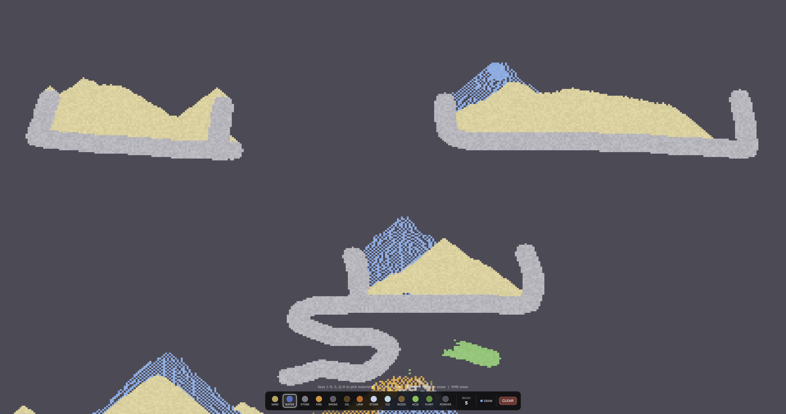

# Pixel Physics Sandbox

A falling-sand style physics simulator built with Three.js. Draw materials on the canvas and watch them interact in real time.



## Getting Started

```bash
npm install
npm run dev
```

Then open [http://localhost:5173](http://localhost:5173).

## Materials

| Key | Material   | Behavior                                          |
|-----|------------|---------------------------------------------------|
| `1` | Sand       | Falls and piles up, slides diagonally             |
| `2` | Water      | Falls and spreads horizontally                    |
| `3` | Stone      | Static solid, blocks everything                   |
| `4` | Fire       | Rises, ignites flammables, burns out into smoke   |
| `5` | Smoke      | Rises and fades away                              |
| `6` | Oil        | Floats on water, burns dramatically               |
| `7` | Lava       | Heavy liquid — water turns it to stone + steam    |
| `8` | Steam      | Rises and slowly condenses back to water          |
| `9` | Ice        | Static solid, melts near fire or lava             |
| `0` | Wood       | Static solid, flammable                           |
| `Q` | Acid       | Flows like water, dissolves stone/sand/wood/plant |
| `W` | Plant      | Spreads slowly through water, flammable           |
| `E` | Gunpowder  | Falls like sand, explodes on contact with fire    |

## Controls

| Input                    | Action                  |
|--------------------------|-------------------------|
| Left click + drag        | Draw selected material  |
| Right click + drag       | Erase                   |
| Scroll wheel / `[` `]`  | Adjust brush size       |
| `Z`                      | Toggle erase mode       |
| `C`                      | Clear canvas            |
| `1`–`9`, `0`, `Q`–`E`   | Select material         |

## Interactions

- **Fire + Water** — fire becomes smoke, water becomes steam
- **Lava + Water / Ice** — lava solidifies to stone, water vaporizes
- **Fire / Lava + Oil, Wood, Plant, Gunpowder** — ignition
- **Gunpowder + Fire** — explosion clears a radius and scatters fire
- **Acid + Stone / Sand / Wood / Plant** — slowly dissolves the material
- **Ice + Fire / Lava** — melts to water
- **Plant + Water** — slowly spreads

## Built With

- [Three.js](https://threejs.org/) — WebGL rendering via DataTexture
- [Vite](https://vitejs.dev/) — dev server and build tool
